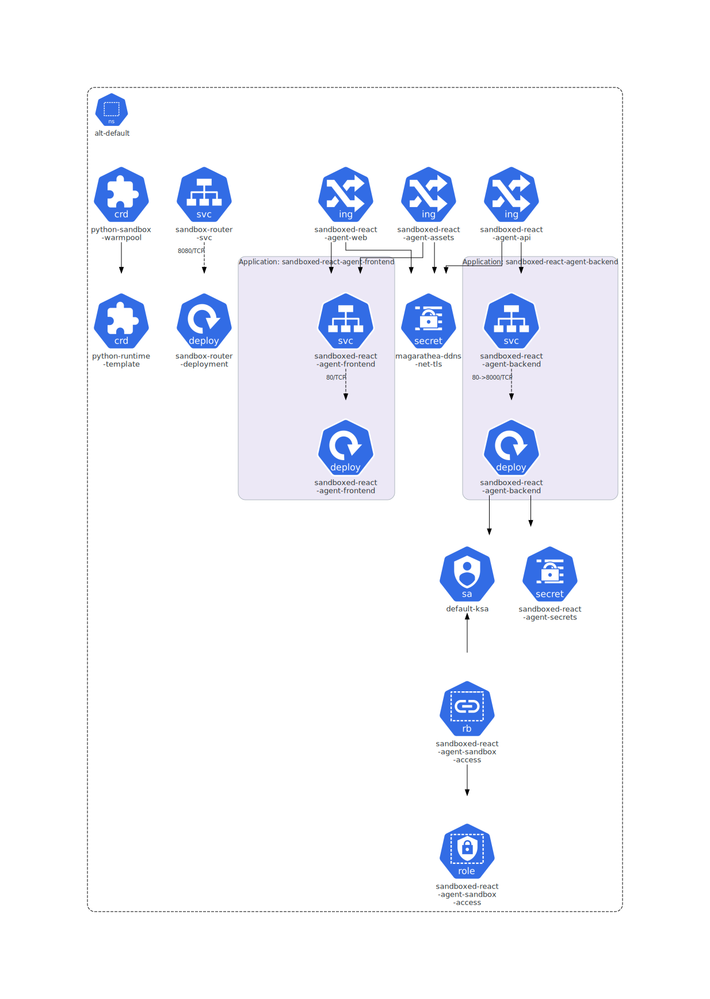
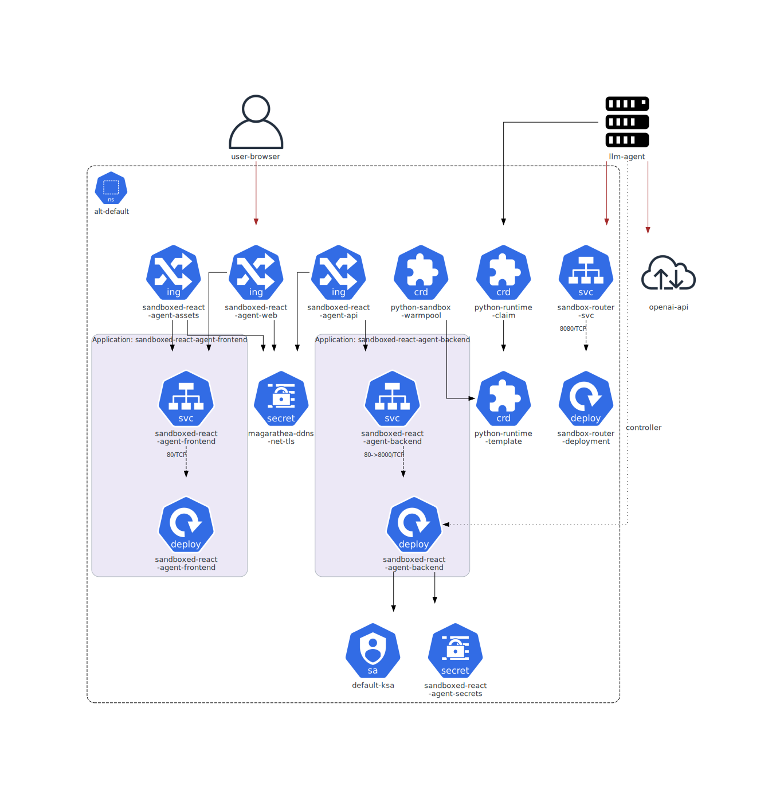

# Sandboxed React Agent

Example full-stack app that demonstrates an LLM tool-calling agent with Python/shell tool execution.

It supports two execution targets:

- `cluster` mode: tool calls execute through Agent Sandbox in GKE.
- `local` mode: tool calls execute inside the backend container (for local testing).

- Frontend: React chat UI.
- Backend: FastAPI `/api/chat` endpoint.
- Tool execution: Agent Sandbox (`cluster`) or local subprocess (`local`).
- Route: `https://magarathea.ddns.net/sandboxed-react-agent`

## Architecture

1. Browser sends chat request to backend (`/sandboxed-react-agent/api/chat`).
2. Backend calls OpenAI with tool definitions (`sandbox_exec_python`, `sandbox_exec_shell`).
3. When tool calls are requested, backend executes them in configured sandbox mode.
4. Tool output is returned to the model and then to the user.

The backend currently uses an in-memory session store (single replica recommended).

## Deployment diagram (KubeDiagrams)

To render diagrams on demand:

```bash
./apps/sandboxed-react-agent/render_k8s_diagrams.sh
```




### Component roles in the cluster

- 🌐 **Ingress (`sandboxed-react-agent-web`, `sandboxed-react-agent-api`)**
  - Terminates external HTTP(S) traffic for `magarathea.ddns.net`.
  - Routes UI requests to frontend and `/api/*` requests to backend.
- 🧩 **Frontend Deployment/Pod (`sandboxed-react-agent-frontend`)**
  - Serves the React app through NGINX.
  - Proxies `/api/*` to backend service (`BACKEND_UPSTREAM` in env).
- ⚙️ **Backend Deployment/Pod (`sandboxed-react-agent-backend`)**
  - Hosts FastAPI endpoints (`/api/chat`, `/api/health`, `/api/config`).
  - Contains the agent logic (LLM call loop + tool orchestration).
  - Uses `k8s-agent-sandbox` SDK in `cluster` mode.
- 🔐 **Secret + ServiceAccount + RBAC**
  - `sandboxed-react-agent-secrets` provides `OPENAI_API_KEY`.
  - `default-ksa` (annotated for Workload Identity) is used by backend.
  - Role/RoleBinding (`backend-sandbox-rbac.yaml`) allows creating `SandboxClaim` and reading related Agent Sandbox CRDs.
- 🛣️ **Sandbox Router (`sandbox-router-svc`, `sandbox-router-deployment`)**
  - Receives backend execution requests and forwards them to a concrete sandbox runtime.
  - Handles routing against claim/sandbox lifecycle resources.
- 🧱 **Agent Sandbox CRDs and runtime resources**
  - `SandboxTemplate` defines sandbox pod spec (runtime image, probes, constraints).
  - `SandboxWarmPool` optionally keeps pre-warmed sandboxes to reduce cold starts.
  - `SandboxClaim` requests an isolated runtime for execution.
  - `Sandbox` represents the bound runtime backing a claim.
  - Runtime pod uses `RuntimeClass: gvisor` and schedules to the gVisor node pool.

### Runtime interaction details

1. User opens the app URL; ingress routes to frontend service/pod.
2. Frontend sends chat input to backend `/api/chat` via ingress/API path.
3. Backend agent sends conversation + tools to OpenAI.
4. If model chooses a tool, backend requests execution through `sandbox-router-svc`.
5. Router ensures a sandbox exists (create/use `SandboxClaim` -> `Sandbox` -> runtime pod).
6. Tool command executes in sandbox runtime pod (`python-runtime-sandbox`).
7. Router returns tool output to backend.
8. Backend sends tool result back to OpenAI for final assistant response.
9. Final answer is returned to frontend and rendered to user.

## Interaction diagram




## Folder structure

- `backend/`: FastAPI service and Dockerfile.
- `frontend/`: React app and Dockerfile.
- `k8s/`: Kubernetes manifests (deployments, services, ingress, secret example).

## Prerequisites

### For Docker Compose local testing

- Docker Engine with Compose v2 (`docker compose ...`).
- OpenAI API key.

### For Kubernetes deployment

- Agent Sandbox controller/extensions and runtime objects already installed in your cluster.
  - In this repo: `iac/gke-secure-gpu-cluster/k8s/agent-sandbox.md`
- Router service reachable in namespace `alt-default`:
  - `sandbox-router-svc.alt-default.svc.cluster.local:8080`
- Sandbox template exists:
  - `python-runtime-template` in namespace `alt-default`
- ingress-nginx and oauth2-proxy already configured for your host.

Quick check:

```bash
kubectl get svc -n alt-default sandbox-router-svc
kubectl get sandboxtemplate -n alt-default python-runtime-template
kubectl get pods -n agent-sandbox-system
```

## Run locally with Docker Compose

This runs frontend + backend on your machine and exposes the app at `http://localhost:8080`.

### Option A: local-only tool execution

1. Create env file:

```bash
cp apps/sandboxed-react-agent/.env.local.example apps/sandboxed-react-agent/.env.local
```

2. Edit `apps/sandboxed-react-agent/.env.local` and set `OPENAI_API_KEY`.

3. Start:

```bash
./apps/sandboxed-react-agent/run-local.sh
```

### Option B: cluster-connected tool execution

1. Forward the cluster sandbox router to your local machine:

```bash
kubectl -n alt-default port-forward svc/sandbox-router-svc 18080:8080
```

2. Create env file:

```bash
cp apps/sandboxed-react-agent/.env.cluster.example apps/sandboxed-react-agent/.env.cluster
```

3. Edit `apps/sandboxed-react-agent/.env.cluster` and set `OPENAI_API_KEY`.

4. Start:

```bash
./apps/sandboxed-react-agent/run-cluster.sh
```

Stop either mode:

```bash
./apps/sandboxed-react-agent/stop-local.sh
```

### Local checks

```bash
curl -sS http://localhost:8080/api/health
curl -sS http://localhost:8080/api/state
```

## Build and publish images (DockerHub)

Set your DockerHub user and image tag:

```bash
export DOCKERHUB_USER=<your-dockerhub-user>
export TAG=0.1.0
```

Build/push backend:

```bash
docker build -t docker.io/${DOCKERHUB_USER}/sandboxed-react-agent-backend:${TAG} ./apps/sandboxed-react-agent/backend
docker push docker.io/${DOCKERHUB_USER}/sandboxed-react-agent-backend:${TAG}
```

Build/push frontend:

```bash
docker build -t docker.io/${DOCKERHUB_USER}/sandboxed-react-agent-frontend:${TAG} ./apps/sandboxed-react-agent/frontend
docker push docker.io/${DOCKERHUB_USER}/sandboxed-react-agent-frontend:${TAG}
```

## Configure manifests

Edit image references in:

- `apps/sandboxed-react-agent/k8s/backend-deployment.yaml`
- `apps/sandboxed-react-agent/k8s/frontend-deployment.yaml`

Replace:

- `docker.io/<your-dockerhub-user>/sandboxed-react-agent-backend:0.1.0`
- `docker.io/<your-dockerhub-user>/sandboxed-react-agent-frontend:0.1.0`

## Create OpenAI key secret

Recommended command:

```bash
kubectl -n alt-default create secret generic sandboxed-react-agent-secrets \
  --from-literal=openai-api-key="$OPENAI_API_KEY" \
  --dry-run=client -o yaml | kubectl apply -f -
```

Optional example file:

- `apps/sandboxed-react-agent/k8s/secret.example.yaml` (do not commit real keys)

## Create Docker pull secret in `alt-default`

If your DockerHub images are private, create the pull secret in the same namespace as the app:

```bash
kubectl get secret dockerhub-regcred -n default -o yaml \
  | sed 's/namespace: default/namespace: alt-default/' \
  | kubectl apply -f -
```

The app deployments are configured to use `imagePullSecrets: [dockerhub-regcred]`.

## Deploy

```bash
kubectl apply -f apps/sandboxed-react-agent/k8s/backend-deployment.yaml
kubectl apply -f apps/sandboxed-react-agent/k8s/backend-service.yaml
kubectl apply -f apps/sandboxed-react-agent/k8s/frontend-deployment.yaml
kubectl apply -f apps/sandboxed-react-agent/k8s/frontend-service.yaml
kubectl apply -f apps/sandboxed-react-agent/k8s/ingress.magarathea.yaml
```

## Verify

```bash
kubectl -n alt-default get deploy,svc,ingress | grep sandboxed-react-agent
kubectl -n alt-default rollout status deploy/sandboxed-react-agent-backend
kubectl -n alt-default rollout status deploy/sandboxed-react-agent-frontend
kubectl -n alt-default logs deploy/sandboxed-react-agent-backend --tail=100
```

Open:

- `https://magarathea.ddns.net/sandboxed-react-agent`

Health/state endpoints:

- `https://magarathea.ddns.net/sandboxed-react-agent/api/health`
- `https://magarathea.ddns.net/sandboxed-react-agent/api/state`

For local Docker Compose runs, open the app at `http://localhost:8080`.

## Runtime configuration from UI

The chat UI includes a **Backend Configuration** panel that can update runtime settings
without restarting the container.

Configurable settings include:

- OpenAI model (`model`)
- Tool safety limit per turn (`max_tool_calls_per_turn`)
- Sandbox mode (`local` or `cluster`)
- Sandbox router/template/namespace and execution limits

The panel calls backend API endpoints:

- `GET /api/config`
- `POST /api/config`

## Kubernetes notes

- The frontend container expects `BACKEND_UPSTREAM` at runtime.
  - In Kubernetes manifests it is set to `sandboxed-react-agent-backend:80`.
  - In Docker Compose it is set to `backend:8000`.
- `default-ksa` requires namespaced RBAC to create Agent Sandbox claims.
  - This repo includes `apps/sandboxed-react-agent/k8s/backend-sandbox-rbac.yaml`.
  - `start.sh` applies it automatically.
- `start.sh` can auto-scale the sandbox router deployment (if present).
  - Enabled by default with `SCALE_SANDBOX_ROUTER=1` and `SANDBOX_ROUTER_REPLICAS=1`.
  - Set `SCALE_SANDBOX_ROUTER=0` to skip this step.

## Kubernetes diagnostics

Run the built-in diagnostics script:

```bash
./apps/sandboxed-react-agent/diagnose_k8s_app.sh
```

Optional parameters:

- `NAMESPACE=alt-default` (default)
- `LOG_SINCE=20m` (window for backend timeout/error detection)
- `TIMEOUT_CURL=60` and `TIMEOUT_WAIT_POD=90s`

## API endpoints

- `POST /api/chat`
  - body: `{ "message": "...", "session_id": "optional" }`
- `GET /api/health`
- `GET /api/state`
- `GET /api/config`
- `POST /api/config`
- `POST /api/sessions/{session_id}/reset`

## Teardown

```bash
kubectl delete -f apps/sandboxed-react-agent/k8s/ingress.magarathea.yaml
kubectl delete -f apps/sandboxed-react-agent/k8s/frontend-service.yaml
kubectl delete -f apps/sandboxed-react-agent/k8s/frontend-deployment.yaml
kubectl delete -f apps/sandboxed-react-agent/k8s/backend-service.yaml
kubectl delete -f apps/sandboxed-react-agent/k8s/backend-deployment.yaml
kubectl -n alt-default delete secret sandboxed-react-agent-secrets
```

## Notes and limitations

- This is an example implementation for rapid iteration.
- Session state is in-memory; scaling backend replicas requires shared session storage.
- In `local` mode, tool commands run in the backend container and are not isolated like Agent Sandbox.
- Add rate limiting, authz, and prompt/tool guardrails before production usage.
